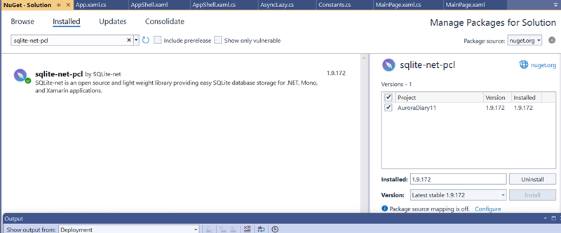
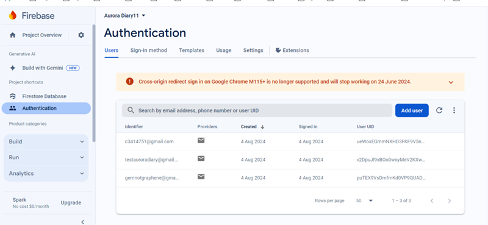

# Project
# INFT6009 Cloud Computing and Mobile Applications for the Enterprise

## Description

Aurora Diary is an application designed to help users capture and preserve invaluable memories and great information. Aurora Diary allows users to quickly jot down notes and save essential details, write complete diary entries if desired, and attach photos for a more personalized experience. It helps one to capture life’s events easily. Aurora Diary will be friendly for recording, writing down critical information, or reflecting. With the above features, Aurora Diary becomes a handy tool for anyone who intends to preserve their life journey in some meaningful, organized way.

## Project Planning

### 1. Storyboards
#### User Login/Registration Flow:
The application starts with a login page. A user logs in with their credentials or passes on to the next page for registration in case they do not have an account. On the run, a registration page is where one creates a new account and details as necessary. On successful login or registration, it will redirect directly to the main diary entry list, where all entries are displayed abreast and manipulated. Safe exposure of personal information; easy segue into the app's core functionality to enhance user experience.

#### Main Diary Entry Flow

The home page contains a list of all the entries a person makes. Each specific entry is represented with its title, date, emotion linked to it, and an optional photo, giving the user an idea of the entries. Each entry expands upon tapping, showing details: it displays the whole content of that entry and the attached photo before the users. This expanded view also allows the user to edit or delete the entry.
A "Add New Entry" button can be clicked for navigation to a form where the title and content of the entry are taken, an emotion is selected, a new photo to be taken, or an existing one from their gallery can be uploaded.

Editing an existing entry is also done by a similar process: the users can edit the title, text, or emotion, or replace the picture. If a user wants to delete an entry, they can do it only from the expanded view that appears immediately after confirming such action.

Its intuitive design ensures that all interactions are smooth and transcendent. Moreover, the user’s experience will be significantly enhanced. SQLite, which is used for local storage of entries, backs up data between sessions in a lightweight yet secure form.

#### Adding/Editing Diary Entries

Users can add/edit diary entries by specifying a title and content and choosing an emotion. They can attach a photo to their entry. They can either take a new picture using the device's camera or use the images that already exist in their galleries to attach photos. This is a flexible way to ensure that users can capture and document their moments easily, which enables them to create content with visuals in diary entries. The intuitive interface guides the user in loading and updating personal diary entries.

#### Settings

The users can change Personal Details, Notification Modes and Logout.

### 2. Data Management

It uses a dual-database system to deal with different aspects of data management.

SQLite: This light, embeddable database is used for local storage of diary entries in the User’s device. This will ensure that users can log in and self-manage their entries offline.

Firebase: Firebase authentication is used for user authentication and saving users who log in to the application securely. This will ensure fluent, secure login across devices.
These will provide a robust and secure foundation for the AuroraDiary application with models and database systems combined, ensuring data integrity, security, and convenience.

### 3. Feature Set and Sensors
#### Camera Integration:
The Aurora Diary app can take photos with a device’s camera, save these captured memorable moments, and then upload them directly to entries. This would allow users to document their experiences in a visual form, making the entries more lively and personal.
#### Image Upload:
It allows a facility to choose an existing picture from the device gallery and attach it against any entry. This flexibility would let users enrich their entries with photos taken at various times and places, adding a third dimension to their documentation.
Firebase Authentication: User registration and login are done with the help of Firebase Authentication. It provides secure authentication that allows users to create an account and log in while showing entries across multiple devices. Firebase ensures robust security features for protecting data while ensuring user privacy.

### 4. SQLite Database

It uses SQLite, a very efficient database that allows users to access and manage their diary entries offline. In this way, one is guaranteed to continue writing and reviewing his or her entries without having an internet connection all the time.
#### Sensor and Hardware:
Camera: Another important device feature is the camera, which can take pictures, send them along with a diary entry, and enhance an app’s functionality, which one can capture from within the app itself.

Storage: Images and diary entries are stored and retrieved within local storage. Thus, all data, whether photos or text-based entries are accessible to the user for a smooth and reliable user experience.
 ### 5. Demonstration Video

 Youtube (https://youtu.be/4Iu-UaO39EE?si=BlJmh9rt4tKyMj4T)

## Assessment Results

